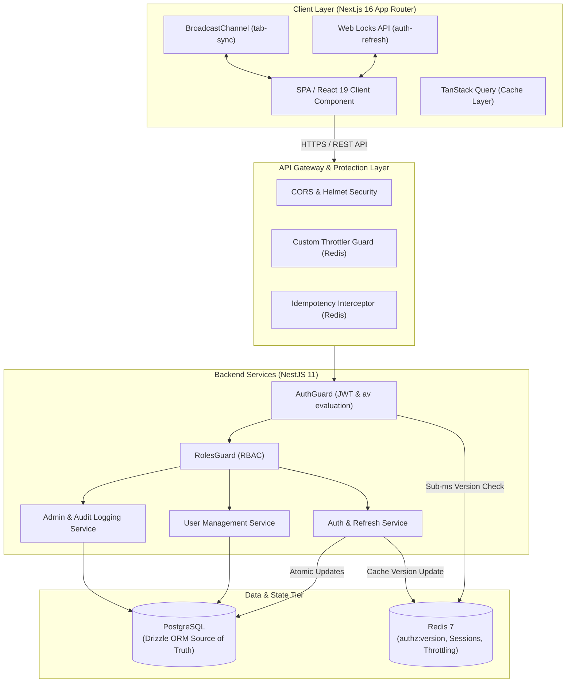
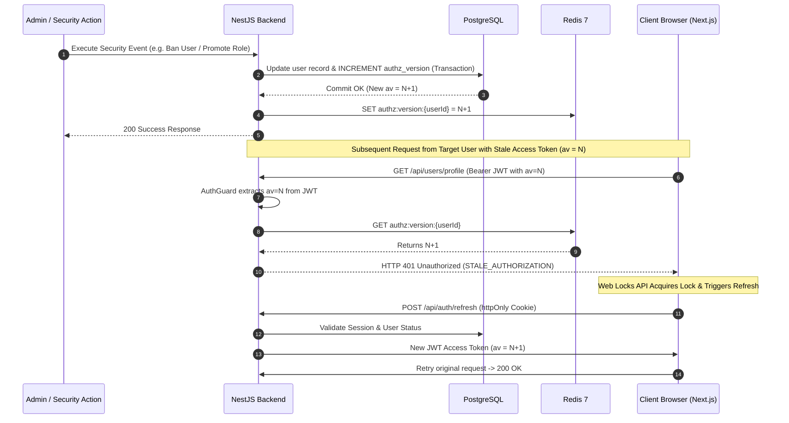
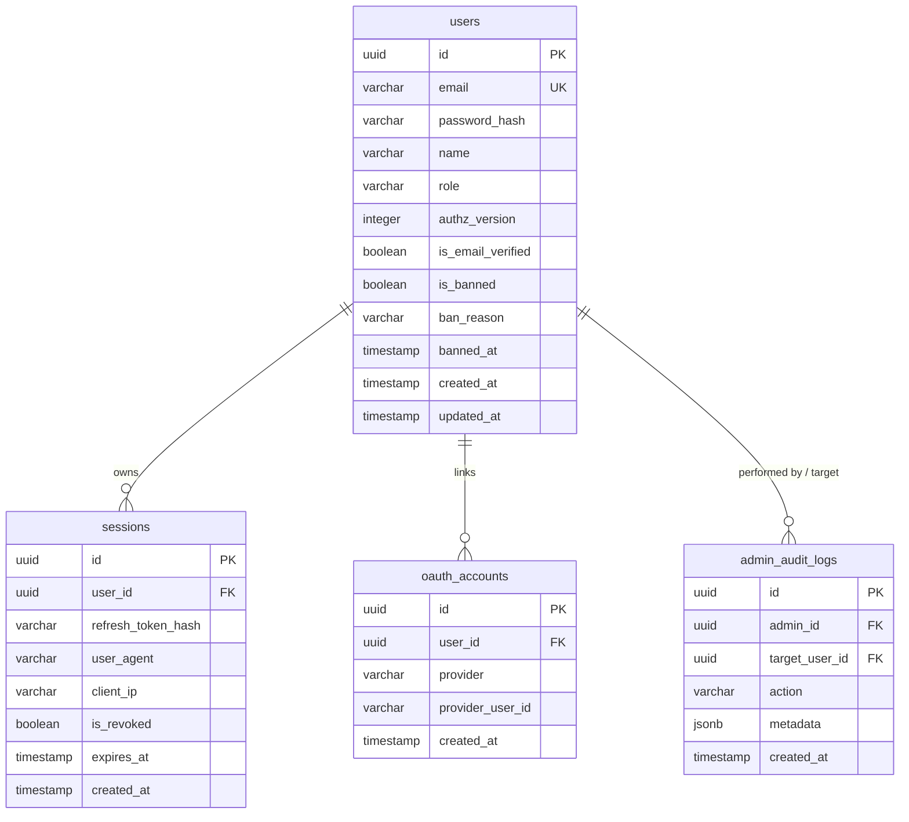

# ⚡ Enterprise Identity, Authentication & Security Infrastructure Template

```text
█████╗ ██╗   ██╗████████╗██╗  ██╗    ████████╗███████╗███╗   ███╗██████╗ ██╗      █████╗ ████████╗███╗   ██╗
██╔══██╗██║   ██║╚══██╔══╝██║  ██║    ╚══██╔══╝██╔════╝████╗ ████║██╔══██╗██║     ██╔══██╗╚══██╔══╝████╗  ██║
███████║██║   ██║   ██║   ███████║       ██║   █████╗  ██╔████╔██║██████╔╝██║     ███████║   ██║   ██╔██╗ ██║
██╔══██║██║   ██║   ██║   ██╔══██║       ██║   ██╔══╝  ██║╚██╔╝██║██╔═══╝ ██║     ██╔══██║   ██║   ██║╚██╗██║
██║  ██║╚██████╔╝   ██║   ██║  ██║       ██║   ███████╗██║ ╚═╝ ██║██║     ███████╗██║  ██║   ██║   ██║ ╚████║
╚═╝  ╚═╝ ╚═════╝    ╚═╝   ╚═╝  ╚═╝       ╚═╝   ╚══════╝╚═╝     ╚═╝╚═╝     ╚══════╝╚═╝  ╚═╝   ╚═╝   ╚═╝  ╚═══╝
    NEXT-GENERATION DISTRIBUTED AUTHENTICATION & AUTHORIZATION ENGINE
```

> **This project template** is an enterprise-grade, high-performance identity management platform engineered for zero-trust security, sub-millisecond authorization evaluation, and seamless real-time multi-tab session synchronization. Built with **NestJS 11**, **Next.js 16 (App Router)**, **Drizzle ORM / PostgreSQL**, and **Redis 7**.

---

## 🌟 Executive Summary

This template solves the classic distributed identity dilemma: **How to provide stateless JWT convenience without sacrificing immediate session revokability and fine-grained access control.**

Traditional JWT implementations force developers into a tradeoff between database query overhead on every request (stateful session checks) or waiting for access tokens to expire (delayed revocation security vulnerabilities). This architecture introduces an explicit, Redis-backed **`authz_version` (Authorization Versioning Engine)** that provides sub-millisecond validation with **0 database entity queries** on protected routes while delivering immediate, global session revocation across all connected devices and browser tabs.

---

## 🚀 Key Highlights & Architecture Innovations

### ⚡ Sub-Millisecond Authorization Invalidation (`authz_version`)
- **Zero-DB Latency:** JWT tokens embed an authorization version snapshot (`av`). High-speed `AuthGuard` evaluates incoming requests against Redis key `authz:version:{userId}` in `< 1ms`.
- **Instant Revocation Cascade:** Any security event (role modification, account ban, password change, session purge) atomically increments `users.authz_version` in PostgreSQL and updates Redis post-commit.
- **Automatic Token Invalidation:** All previously issued access tokens become instantly stale, returning `401 STALE_AUTHORIZATION` and triggering client-side background token refresh or security isolation.

### 🔄 Web Locks API Multi-Tab Refresh Synchronization
- **Tab Race-Condition Elimination:** Uses browser-native `navigator.locks.request('auth-refresh')` to prevent multiple open browser tabs from making duplicate refresh requests.
- **BroadcastChannel Event Propagation:** Cross-tab state synchronization notifies inactive tabs instantly when user identity, roles, or sessions change.

### 🛡️ Enterprise-Grade Security & Idempotency
- **Redis-Backed Idempotency Engine:** Prevents duplicate form submissions or API re-execution using `X-Idempotency-Key` headers with distributed locks.
- **Granular Rate Limiting:** Multi-tiered throttling powered by `@nestjs/throttler` and Redis storage, with dynamic limits for public, authentication, and admin endpoints.
- **Audit Logging Engine:** Tamper-evident administrative action logging tracking bans, unbans, role promotions, and session purges with contextual JSON metadata.
- **OAuth 2.0 PKCE & Account Linking:** Seamless Google OpenID Connect implementation supporting automatic account matching, manual profile linking/unlinking, and OAuth account creation.

---

## 🏛️ System Architecture



---

## 🔍 Deep-Dive: Authorization Versioning (`authz_version`) Engine

### Token Invalidation Workflow



---

## 📊 Core Technology Stack

| Layer | Framework / Library | Version | Purpose & Rationale |
|---|---|---|---|
| **Backend Framework** | NestJS | `v11.0.1` | Enterprise Node.js framework providing clean dependency injection and modular design |
| **Frontend Framework** | Next.js (App Router) | `v16.3.0` | React 19 Server Components, Server Actions, Turbopack bundling |
| **Database ORM** | Drizzle ORM | `v1.0.0-rc.4` | Type-safe SQL query builder with zero abstraction overhead |
| **Primary Database** | PostgreSQL | `v16` | Relational data integrity, transactional constraints, and JSONB audit logs |
| **In-Memory Store** | Redis | `v7.0` | High-speed authorization versioning, rate limiting, and idempotency locks |
| **State Management** | TanStack Query | `v5.100.14` | Client-side async state synchronization and caching |
| **Styling & UI** | Tailwind CSS v4 + Radix UI | Latest | Accessible, unstyled UI primitives styled with modern design tokens |
| **API Protocol** | OpenAPI 3.0 / Swagger | `v11.4.5` | Self-documenting interactive API endpoints (`/api/docs`) |

---

## ⚡ Performance Benchmarks & Targets

```text
┌──────────────────────────────────────┬────────────────┬─────────────────┐
│ Operation                            │ Metric         │ Target Benchmark│
├──────────────────────────────────────┼────────────────┼─────────────────┤
│ Authz Guard Version Evaluation        │ Latency        │ < 0.8 ms        │
│ Protected Endpoint Response           │ P95 Latency    │ < 15 ms         │
│ Idempotent Request De-duplication     │ Lock Latency   │ < 1.2 ms        │
│ Multi-Tab Refresh Lock Acquisition   │ Contention     │ < 2.0 ms        │
│ Concurrent Session Purge (100k users)│ System Impact  │ Atomic (0 downtime)│
└──────────────────────────────────────┴────────────────┴─────────────────┘
```

---

## 🔑 Comprehensive Feature Matrix

### 👤 Identity & User Lifecycle
- [x] **Email & Password Authentication:** Bcrypt password hashing (`@node-rs/bcrypt`), token-based email verification, and rate-limited resend flow.
- [x] **OAuth 2.0 OpenID Connect:** Google OAuth integration using `openid-client` with PKCE validation, state checking, and secure account binding.
- [x] **Session Management Engine:** Multi-device session tracking with user-agent, IP logging, granular session revocation, and bulk session purge.
- [x] **Self-Service Security:** Authenticated password updates, OAuth profile linking/unlinking, profile updates, and voluntary account deletion.

### 🛡️ Administrative & Control Center
- [x] **Paginated User Directory:** High-performance user searching, filtering (role, verification, ban status), and dynamic sorting.
- [x] **User Ban Engine:** Temporary and permanent banning mechanisms with mandatory administrative reasoning, automated session purge, and ban audit history.
- [x] **Role-Based Access Control (RBAC):** Hierarchical roles (`user`, `admin`) enforced via `@Roles()` decorators and `RolesGuard`.
- [x] **Admin Audit Log Console:** Complete trail of administrative actions featuring JSON diff inspection, pagination, and filterable event logs (`ban_user`, `unban_user`, `change_role`, `revoke_session`).

---

## 🗄️ Database Schema & Data Models



---

## 🛠️ API Architecture & Endpoint Specification

### Public & Authentication Endpoints (`/api/auth`)
- `POST /api/auth/register` — Create new user account with verification token delivery.
- `POST /api/auth/login` — Authenticate credentials and receive Access JWT + Refresh Cookie.
- `POST /api/auth/refresh` — Issue fresh access token (protected by Web Locks API lock).
- `POST /api/auth/logout` — Revoke active session and purge refresh token cookie.
- `GET /api/auth/verify-email` — Validate email confirmation token.
- `POST /api/auth/forgot-password` — Request password reset link.
- `POST /api/auth/reset-password` — Set new password using valid reset token.
- `GET /api/auth/google` — Initiate OAuth 2.0 PKCE flow.
- `GET /api/auth/google/callback` — Handle OAuth redirection and session setup.

### Profile & Session Endpoints (`/api/users`)
- `GET /api/users/profile` — Fetch current authenticated user state.
- `PATCH /api/users/profile` — Update account profile information.
- `POST /api/users/change-password` — Authenticated password rotation.
- `GET /api/users/sessions` — List active login sessions across devices.
- `DELETE /api/users/sessions/:id` — Terminate specific device session.
- `DELETE /api/users/sessions/others` — Revoke all other active device sessions.

### Administrative Endpoints (`/api/admin`)
- `GET /api/admin/users` — Search and filter system users with pagination.
- `GET /api/admin/users/:id` — Detailed user view including ban history and sessions.
- `POST /api/admin/users/:id/ban` — Ban user, purge active sessions, and increment `authz_version`.
- `POST /api/admin/users/:id/unban` — Restore account access and update audit log.
- `POST /api/admin/users/:id/role` — Modify user role (`user` <-> `admin`) with instant token invalidation.
- `GET /api/admin/audit-logs` — Retrieve system audit logs with filterable actions.

---

## 💻 Developer Setup & Installation Guide

### Prerequisites
- **Node.js:** `v24.x` or later
- **Docker & Docker Compose:** Installed and running
- **Package Manager:** `npm` or `pnpm`

### 1. Repository Setup & Environment Configuration
```bash
# Clone the workspace
git clone https://github.com/your-org/project-template.git
cd project-template

# Setup Backend Environment
cp back-end/.env.example back-end/.env

# Setup Frontend Environment
cp front-end/.env.example front-end/.env.local
```

### 2. Infrastructure Spin-up (Docker)
```bash
cd back-end
docker-compose up -d
# Spawns PostgreSQL on port 5432 and Redis on port 6379
```

### 3. Database Migration & Schema Seeding
```bash
cd back-end
npm install
npm run db:generate
npm run db:migrate
```

### 4. Running Development Servers
```bash
# Terminal 1 — NestJS API Service
cd back-end
npm run start:dev

# Terminal 2 — Next.js Frontend Client
cd front-end
npm install
npm run dev
```

> **Interactive Swagger API Documentation:** Available at `http://localhost:4000/api/docs`  
> **Frontend Application:** Access at `http://localhost:3000`

---

## 🎨 Design System & Visual Excellence

This project features a modern, fluid visual identity built on custom CSS variables, glassmorphic overlays, and accessible dynamic micro-interactions:

- **Color Palette:** Curated deep obsidian background (`#0b0f17`), neon emerald accents (`#10b981`), royal indigo gradients (`#6366f1`), and crisp muted slate typography.
- **Typography:** Inter & JetBrains Mono font pairings for maximum legibility in technical administrative code blocks.
- **Responsive Components:** Built with Radix UI primitives ensuring complete keyboard navigation, ARIA accessibility, and smooth state transitions.

---

## 📄 License & Maintainers

This project template is maintained by the Core Infrastructure Team. Published under the **MIT License**.

```text
Crafted with precision for high-performance enterprise applications.
```
