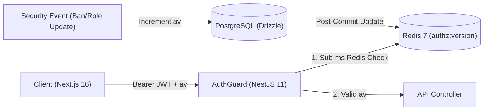

# ⚡ Enterprise Distributed Auth & Identity Engine Template

[](https://nestjs.com/)
[](https://nextjs.org/)
[](https://www.typescriptlang.org/)
[](https://orm.drizzle.team/)
[](https://redis.io/)
[](LICENSE)

> This project template is an enterprise-grade identity control system designed for high-throughput distributed applications. It solves the stateless vs stateful auth dilemma with an explicit **Authorization Versioning Engine (`authz_version`)**, giving you **sub-millisecond token verification** with **zero DB queries** on protected routes and **immediate global session invalidation**.

---

## 🚀 Key Features

- **⚡ Sub-Millisecond Authorization Check:** Evaluates access tokens against Redis `authz:version:{userId}` in `< 1ms`.
- **💥 Instant Global Revocation:** Role updates, user bans, password changes, or session terminations immediately increment `authz_version` and revoke all issued tokens across devices.
- **🔒 Web Locks & Multi-Tab Synchronization:** Prevents race conditions during token refresh across multiple open tabs using `navigator.locks` and `BroadcastChannel`.
- **🔑 Google OAuth 2.0 PKCE:** OpenID Connect integration with automatic profile linking, unlinking, and failure redirect handling.
- **🛡️ Enterprise Idempotency & Rate-Limiting:** Redis-backed `X-Idempotency-Key` handling and customizable endpoint throttling.
- **📊 Admin Control Center & Audit Logs:** User directory with search, ban management, role assignment, and granular audit trail.

---

## 🏛️ System Architecture Overview



---

## 📂 Repository Structure

```text
project-template/
├── apps/
│   ├── backend/            # NestJS 11 REST API Service
│   │   ├── src/
│   │   │   ├── auth/       # Login, Register, OAuth, Refresh, Verification
│   │   │   ├── users/      # Profile management & Admin User CRUD
│   │   │   ├── common/     # AuthzVersionService, Idempotency, Throttling, Guards
│   │   │   ├── db/         # Drizzle Schema & PostgreSQL Connection
│   │   │   └── email/      # Transactional Email Templates (Resend)
│   │   └── PROJECT_REFERENCE.md # Technical Backend Architecture Reference
│   └── frontend/           # Next.js 16 App Router Client
│       ├── app/            # React Server Components & Action Handlers
│       ├── components/     # Radix UI & Modern Tailwind Components
│       └── PROJECT_REFERENCE.md # Technical Frontend Architecture Reference
├── pnpm-workspace.yaml     # Workspace declaration
├── PROJECT.md              # 📖 Master Project Specification & Deep-Dive
└── README.md               # 📌 Root Portal & Overview Guide
```

---

## ⚡ Quickstart

### 1. Launch Infrastructure & Install Dependencies
```bash
pnpm install
cd apps/backend && docker-compose up -d
```

### 2. Start Backend API
```bash
pnpm dev:back
# OR: cd apps/backend && pnpm start:dev
```
> Interactive API Docs: `http://localhost:4000/api/docs`

### 3. Start Frontend Client
```bash
pnpm dev:front
# OR: cd apps/frontend && pnpm dev
```
> Frontend Application: `http://localhost:3000`

---

## 📑 Full Documentation

For deep technical specifications, sequence diagrams, database schemas, performance benchmarks, and endpoint matrices, consult the master project file:

👉 **[PROJECT.md](file:///home/mohamed/Documents/traqon/PROJECT.md)**

---

## 📜 License

Distributed under the MIT License.
